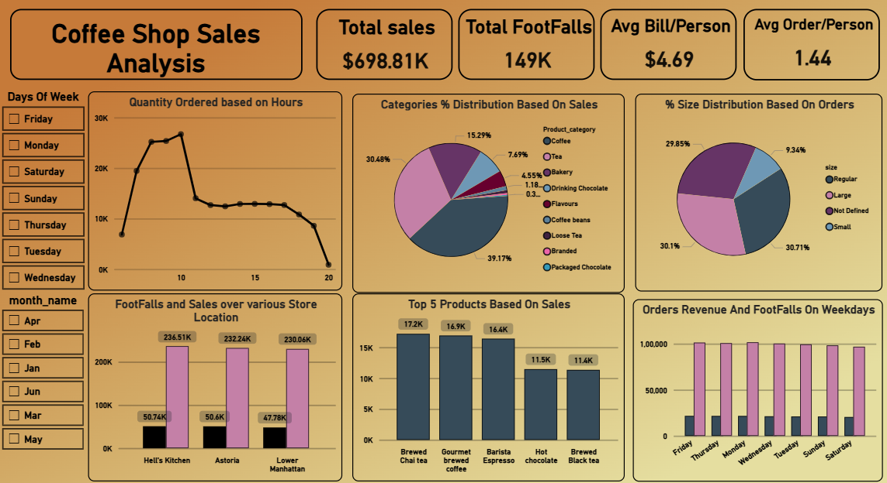
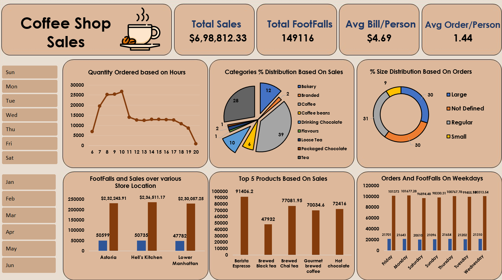

# Coffee-Shop-Sales-Analysis
SQL + Excel + Power BI analysis of coffee shop sales data

# ☕ Coffee Shop Sales Analysis | SQL + Excel + Power BI

## Project Overview
Analysis of transactional coffee shop sales data across 3 store locations 
to evaluate revenue performance, customer traffic, and product demand patterns.

## Tools Used
- **SQL (MySQL)** — Data cleaning and transformation
- **Excel** — Exploratory analysis and dashboard
- **Power BI** — Interactive visualization

## Key Metrics
| Metric | Value |
|--------|-------|
| Total Sales | $698.81K |
| Total Footfall | 149K |
| Avg Bill/Person | $4.69 |
| Avg Order/Person | 1.44 |

## Key Insights
- 🕗 Peak orders between 7–10am — morning ritual and corporate commuters
- 📍 Hell's Kitchen leads with $236.51K revenue
- ☕ Customers rotating between Regular and Large — upselling opportunity
- 🏆 Barista Espresso and Brewed Chai Tea driving the menu

## Files
- COFFEE_SQL.sql — All SQL queries
- COFFE_SALES_ANALYSIS_DASBOARD_EXCEL.png — Excel dashboard
- COFFE_SALES_ANALYSIS_DASHBOARD_POWERBI.png — Power BI dashboard

## Power BI Dashboard

## Excel Dashboard

